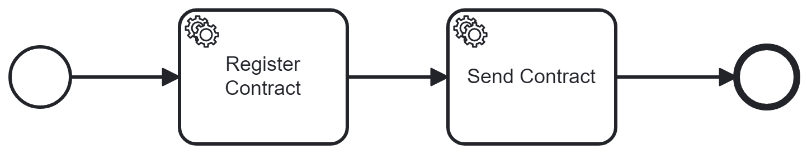

# dapr-workflow-bpmn-generator

This repository contains an experimental Source Generator that generates Dapr Workflows from BPMN 2.0 files.

## Supported BPMN constructs

| Category      | Element                     | Supported |
| ------------- | --------------------------- | :-------: |
| Participants  | Pool                        |           |
| Sub Processes | Subprocess                  |     Y     |
|               | Call Activity               |     Y     |
|               | Event Subprocess            |           |
|               | Transaction                 |           |
| Tasks         | Service Task                |     Y     |
|               | User Task                   |     Y     |
|               | Script Task                 |     Y     |
|               | Business Rule Task          |           |
|               | Manual Task                 |     Y     |
|               | Receive Task                |     Y     |
|               | Undefined Task              |           |
|               | Send Task                   |     Y     |
|               | Receive Task (instantiated) |           |
| Gateways      | Exclusive Gateway           |     Y     |
|               | Inclusive Gateway           |     Y     |
|               | Parallel Gateway            |     Y     |
|               | Event-based Gateway         |           |
|               | Complex Gateway             |           |

Events

| Type              | Normal Start | Sub process | Sub process non-interupted | Intermediate catch | Intermediate boundary | Intermediate boundary non-interrupt | Intermediate throw |  End  |
| ----------------- | :----------: | :---------: | :------------------------: | :----------------: | :-------------------: | :---------------------------------: | :----------------: | :---: |
| None              |      Y       |      -      |             -              |         -          |           -           |                  -                  |         Y          |   Y   |
| Message           |              |             |                            |         Y          |                       |                                     |         Y          |       |
| Timer             |              |             |                            |         Y          |                       |                  Y                  |         -          |   -   |
| Conditional       |              |             |                            |         Y          |                       |                                     |         -          |   -   |
| Link              |      -       |      -      |             -              |         Y          |           -           |                  -                  |         Y          |   -   |
| Signal            |              |             |                            |                    |                       |                                     |                    |       |
| Error             |      -       |             |             -              |         -          |           Y           |                  -                  |         -          |       |
| Escalation        |      -       |             |                            |         -          |                       |                                     |                    |       |
| Termination       |      -       |      -      |             -              |         -          |           -           |                  -                  |         -          |       |
| Compensation      |              |             |             -              |         -          |                       |                  -                  |                    |       |
| Cancel            |      -       |      -      |             -              |         -          |                       |                  -                  |         -          |       |
| Multiple          |              |             |                            |                    |                       |                                     |                    |       |
| Multiple Parallel |              |             |                            |                    |                       |                                     |                    |   -   |

## How it works

* The Source Generator generates a DaprWorkflow for each Process in a BPMN file.
* A Dapr Workflow Activity is generated for each ServiceTask in the Process.
* For each supported flow element in the Process a private method is generated in the Workflow class.
* Each generated method returns the next methods to call.

This might sound a little abstract, so lets workout a simple example, lets write the Workflow manually using the following BPMN workflow:



```xml
<?xml version="1.0" encoding="UTF-8"?>
<bpmn:definitions xmlns:bpmn="http://www.omg.org/spec/BPMN/20100524/MODEL" xmlns:bpmndi="http://www.omg.org/spec/BPMN/20100524/DI" xmlns:dc="http://www.omg.org/spec/DD/20100524/DC" xmlns:di="http://www.omg.org/spec/DD/20100524/DI" xmlns:modeler="http://camunda.org/schema/modeler/1.0" id="Definitions_0x1ez33" targetNamespace="http://bpmn.io/schema/bpmn" exporter="Camunda Modeler" exporterVersion="5.16.0" modeler:executionPlatform="Camunda Cloud" modeler:executionPlatformVersion="8.3.0">
  <bpmn:process id="SampleProcess" isExecutable="true">
    <bpmn:startEvent id="StartEvent">
      <bpmn:outgoing>Flow_0zngdjw</bpmn:outgoing>
    </bpmn:startEvent>
    <bpmn:sequenceFlow id="Flow_0zngdjw" sourceRef="StartEvent" targetRef="RegisterContract" />
    <bpmn:serviceTask id="RegisterContract" name="Register Contract">
      <bpmn:incoming>Flow_0zngdjw</bpmn:incoming>
      <bpmn:outgoing>Flow_1js42u4</bpmn:outgoing>
    </bpmn:serviceTask>
    <bpmn:sequenceFlow id="Flow_1js42u4" sourceRef="RegisterContract" targetRef="SendContract" />
    <bpmn:serviceTask id="SendContract" name="Send Contract">
      <bpmn:incoming>Flow_1js42u4</bpmn:incoming>
      <bpmn:outgoing>Flow_17qojnt</bpmn:outgoing>
    </bpmn:serviceTask>
    <bpmn:endEvent id="EndEvent">
      <bpmn:incoming>Flow_17qojnt</bpmn:incoming>
    </bpmn:endEvent>
    <bpmn:sequenceFlow id="Flow_17qojnt" sourceRef="SendContract" targetRef="EndEvent" />
  </bpmn:process>
  <bpmndi:BPMNDiagram id="BPMNDiagram_1">
    <!-- omitted for clarity -->
  </bpmndi:BPMNDiagram>
</bpmn:definitions>

```

Now lets start and create some skeleton classes for the Dapr Workflow:

```c#
namespace Examples.Workflows;

using Dapr.Workflow;

public class SampleProcessWorkflow : Workflow<?, ?>
{
    public override Task<?> RunAsync(WorkflowContext context, ? input)
    {
        throw new NotImplementedException();
    }
}

public partial class RegisterContractActivity : WorkflowActivity<?, ?>
{
    public override Task<?> RunAsync(WorkflowActivityContext context, ? input)
    {
        throw new NotImplementedException();
    }
}

public partial class SendContractActivity : WorkflowActivity<?, ?>
{
    public override Task<?> RunAsync(WorkflowActivityContext context, ? input)
    {
        throw new NotImplementedException();
    }
}
```

As you can see there are some question marks in this code. Each Workflow and WorkflowActivity needs to define types for input and output.
We need a way to define these types in the BPMN file because these types are often part of a shared model.

BPMN provides constructs for data modeling but they are very verbose. BPMN is extensible so lets define something simple first. We need to define the input and output types and names.

```xml
<?xml version="1.0" encoding="UTF-8"?>
<bpmn:definitions xmlns:bpmn="http://www.omg.org/spec/BPMN/20100524/MODEL" xmlns:bpmndi="http://www.omg.org/spec/BPMN/20100524/DI" xmlns:dc="http://www.omg.org/spec/DD/20100524/DC" xmlns:di="http://www.omg.org/spec/DD/20100524/DI" xmlns:modeler="http://camunda.org/schema/modeler/1.0" id="Definitions_0x1ez33" targetNamespace="http://bpmn.io/schema/bpmn" exporter="Camunda Modeler" exporterVersion="5.16.0" modeler:executionPlatform="Camunda Cloud" modeler:executionPlatformVersion="8.3.0">
  <bpmn:process id="SampleProcess" isExecutable="true">
    <bpmn:extensionElements>
        <dapr:inputOutput>
            <dapr:inputParameter name="" type="" />
            <dapr:outputParameter name="" type="" />
        </dapr:inputOutput>
    </bpmn:extensionElements>
    <bpmn:startEvent id="StartEvent">
      <bpmn:outgoing>Flow_0zngdjw</bpmn:outgoing>
    </bpmn:startEvent>
    <bpmn:sequenceFlow id="Flow_0zngdjw" sourceRef="StartEvent" targetRef="RegisterContract" />
    <bpmn:serviceTask id="RegisterContract" name="Register Contract">
      <bpmn:incoming>Flow_0zngdjw</bpmn:incoming>
      <bpmn:outgoing>Flow_1js42u4</bpmn:outgoing>
    </bpmn:serviceTask>
    <bpmn:sequenceFlow id="Flow_1js42u4" sourceRef="RegisterContract" targetRef="SendContract" />
    <bpmn:serviceTask id="SendContract" name="Send Contract">
      <bpmn:incoming>Flow_1js42u4</bpmn:incoming>
      <bpmn:outgoing>Flow_17qojnt</bpmn:outgoing>
    </bpmn:serviceTask>
    <bpmn:endEvent id="EndEvent">
      <bpmn:incoming>Flow_17qojnt</bpmn:incoming>
    </bpmn:endEvent>
    <bpmn:sequenceFlow id="Flow_17qojnt" sourceRef="SendContract" targetRef="EndEvent" />
  </bpmn:process>
  <bpmndi:BPMNDiagram id="BPMNDiagram_1">
    <!-- omitted for clarity -->
  </bpmndi:BPMNDiagram>
</bpmn:definitions>
```